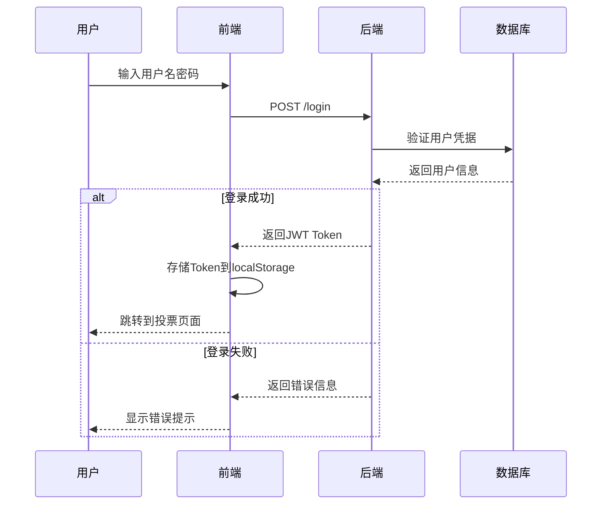
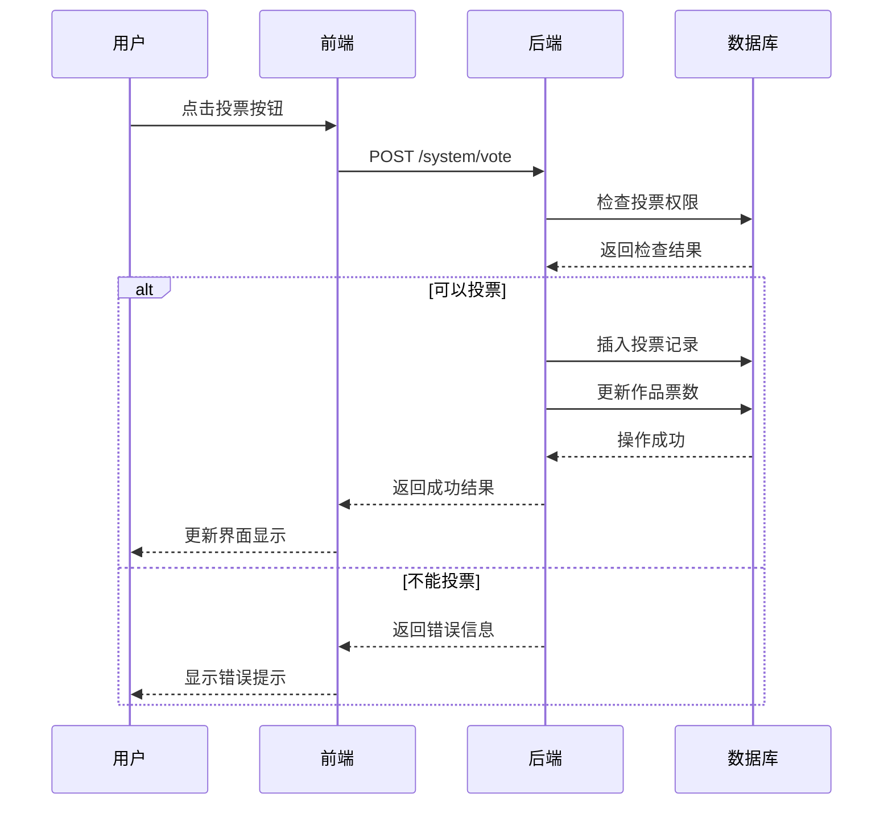
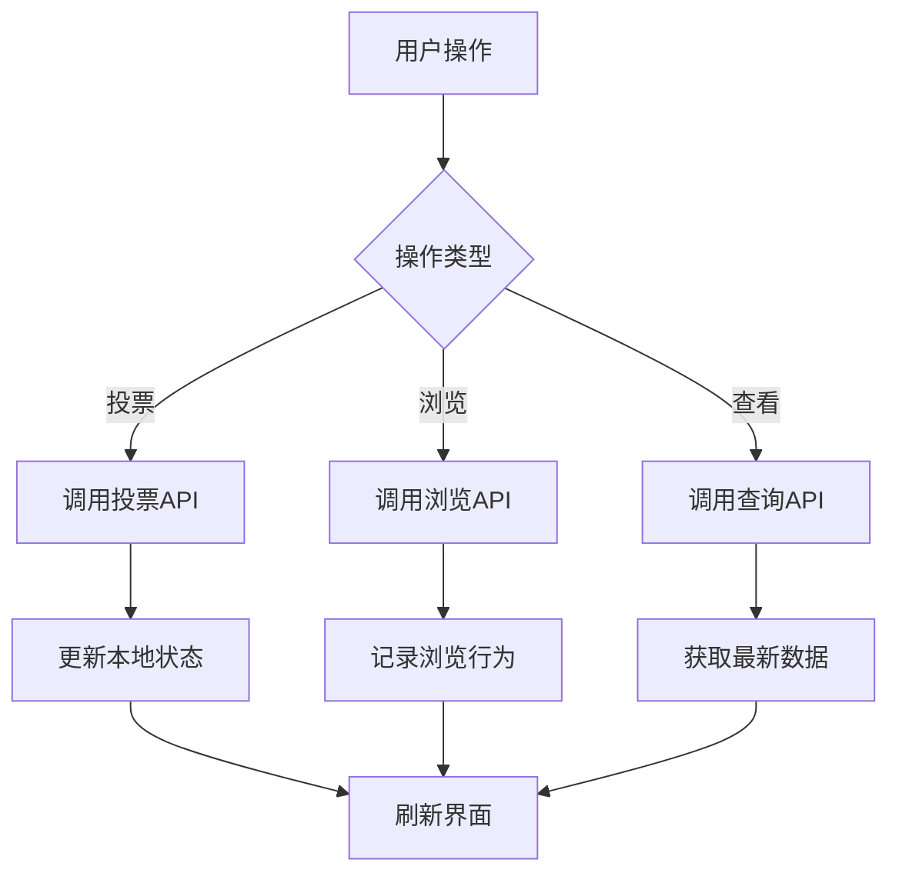

# 龙舟投票系统全栈迁移设计文档

## 系统架构概览

### 整体架构
```
┌─────────────────┐    ┌─────────────────┐    ┌─────────────────┐
│   前端 (Vue3)   │    │  后端 (RuoYi)   │    │  数据库 (MySQL) │
│                 │    │                 │    │                 │
│ - 投票页面      │◄──►│ - REST API      │◄──►│ - 4张核心表     │
│ - 排行榜页面    │    │ - 业务逻辑      │    │ - 存储过程      │
│ - 详情页面      │    │ - 数据验证      │    │ - 索引优化      │
│ - 规则页面      │    │ - 权限控制      │    │ - 视图查询      │
└─────────────────┘    └─────────────────┘    └─────────────────┘
```

### 技术栈选择

#### 前端技术栈
- **Vue 3**: 保持现有框架
- **TypeScript**: 类型安全
- **Pinia**: 状态管理
- **Axios**: HTTP客户端
- **Element Plus**: UI组件库（RuoYi默认）

#### 后端技术栈
- **Spring Boot**: RuoYi框架核心
- **MyBatis-Plus**: ORM框架
- **Spring Security**: 安全框架
- **Redis**: 缓存和会话管理
- **MySQL**: 主数据库

## 数据库设计

### 核心表结构

#### 1. 作品信息表 (longzhou_work)
```sql
CREATE TABLE `longzhou_work` (
  `work_id` bigint(20) NOT NULL AUTO_INCREMENT COMMENT '作品ID',
  `work_title` varchar(100) NOT NULL COMMENT '作品标题',
  `work_author` varchar(50) NOT NULL COMMENT '作者姓名',
  `work_description` text COMMENT '作品描述',
  `work_image` varchar(500) DEFAULT NULL COMMENT '作品主图',
  `total_votes` bigint(20) DEFAULT 0 COMMENT '总投票数',
  `today_votes` bigint(20) DEFAULT 0 COMMENT '今日投票数',
  `total_views` bigint(20) DEFAULT 0 COMMENT '总浏览数',
  `today_views` bigint(20) DEFAULT 0 COMMENT '今日浏览数',
  `ranking` int(11) DEFAULT 0 COMMENT '当前排名',
  `status` tinyint(1) DEFAULT 1 COMMENT '状态(1:正常 0:删除)',
  PRIMARY KEY (`work_id`)
) ENGINE=InnoDB DEFAULT CHARSET=utf8mb4 COMMENT='作品信息表';
```

#### 2. 投票记录表 (longzhou_vote_record)
```sql
CREATE TABLE `longzhou_vote_record` (
  `vote_id` bigint(20) NOT NULL AUTO_INCREMENT COMMENT '投票记录ID',
  `user_id` bigint(20) NOT NULL COMMENT '用户ID（关联sys_user.user_id）',
  `team_id` bigint(20) NOT NULL COMMENT '队伍ID',
  `vote_date` date NOT NULL COMMENT '投票日期',
  `vote_time` datetime NOT NULL DEFAULT CURRENT_TIMESTAMP COMMENT '投票时间',
  `user_ip` varchar(50) DEFAULT NULL COMMENT '用户IP地址',
  `status` tinyint(1) DEFAULT 1 COMMENT '状态(1:有效 0:无效)',
  PRIMARY KEY (`vote_id`),
  UNIQUE KEY `uk_user_team_date` (`user_id`, `team_id`, `vote_date`),
  FOREIGN KEY (`user_id`) REFERENCES `sys_user`(`user_id`)
) ENGINE=InnoDB DEFAULT CHARSET=utf8mb4 COMMENT='投票记录表';
```

#### 3. 活动配置表 (longzhou_activity_config)
```sql
CREATE TABLE `longzhou_activity_config` (
  `config_id` bigint(20) NOT NULL AUTO_INCREMENT COMMENT '配置ID',
  `activity_name` varchar(100) NOT NULL COMMENT '活动名称',
  `rule_image` varchar(500) DEFAULT NULL COMMENT '规则页面图片URL',
  `daily_vote_limit` int(11) DEFAULT 3 COMMENT '每日投票限制次数',
  `start_time` datetime NOT NULL COMMENT '活动开始时间',
  `end_time` datetime NOT NULL COMMENT '活动结束时间',
  `activity_rules` text COMMENT '活动规则详细说明',
  `status` tinyint(1) DEFAULT 1 COMMENT '状态(1:启用 0:禁用)',
  PRIMARY KEY (`config_id`)
) ENGINE=InnoDB DEFAULT CHARSET=utf8mb4 COMMENT='活动配置表';
```

#### 4. 浏览记录表 (longzhou_view_record)
```sql
CREATE TABLE `longzhou_view_record` (
  `view_id` bigint(20) NOT NULL AUTO_INCREMENT COMMENT '浏览记录ID',
  `work_id` bigint(20) NOT NULL COMMENT '作品ID',
  `user_id` bigint(20) DEFAULT NULL COMMENT '用户ID（关联sys_user.user_id，游客为NULL）',
  `user_ip` varchar(50) DEFAULT NULL COMMENT '用户IP',
  `view_date` date NOT NULL COMMENT '浏览日期',
  `view_time` datetime NOT NULL DEFAULT CURRENT_TIMESTAMP COMMENT '浏览时间',
  PRIMARY KEY (`view_id`),
  FOREIGN KEY (`user_id`) REFERENCES `sys_user`(`user_id`)
) ENGINE=InnoDB DEFAULT CHARSET=utf8mb4 COMMENT='浏览记录表';
```

## API接口设计

### RESTful API规范

#### 基础响应格式
```json
{
  "code": 200,
  "msg": "操作成功",
  "data": {}
}
```

#### 核心接口列表

##### 用户认证接口
```
POST   /login                      # 用户登录
POST   /logout                     # 用户退出
GET    /getInfo                    # 获取用户信息
POST   /register                   # 用户注册（可选）
```

##### 作品相关接口
```
GET    /system/work/list           # 获取作品列表（游客可访问）
GET    /system/work/{workId}       # 获取作品详情（游客可访问）
GET    /system/work/ranking        # 获取排行榜（游客可访问）
POST   /system/work/view           # 记录浏览（游客可访问）
```

##### 投票相关接口（需要登录）
```
POST   /system/vote                # 用户投票
DELETE /system/vote                # 取消投票
GET    /system/vote/status         # 获取当前用户投票状态
GET    /system/vote/records        # 获取当前用户投票记录
```

##### 配置相关接口
```
GET    /system/config/activity     # 获取活动配置（游客可访问）
PUT    /system/config/activity     # 更新活动配置（管理员）
GET    /system/config/rules        # 获取活动规则（游客可访问）
```

## 前端架构设计

### 组件层次结构
```
src/
├── api/                    # API服务层
│   ├── work.js            # 作品相关API
│   ├── vote.js            # 投票相关API
│   └── config.js          # 配置相关API
├── stores/                # 状态管理
│   └── teams.js           # 作品数据管理
├── views/                 # 页面组件
│   ├── LoginPage.vue      # 登录页面
│   ├── VotePage.vue       # 投票页面
│   ├── RankPage.vue       # 排行榜页面
│   ├── DetailPage.vue     # 详情页面
│   └── RulePage.vue       # 规则页面
└── components/            # 公共组件
    ├── TeamVoteCard.vue   # 投票卡片
    ├── TopThreeRanks.vue  # 前三名展示
    └── DetailInfo.vue     # 详情信息
```

### 登录界面设计

#### 登录页面组件 (LoginPage.vue)
```vue
<template>
  <div class="login-container">
    <div class="login-form">
      <h2>龙舟投票系统</h2>
      <el-form :model="loginForm" :rules="loginRules" ref="loginFormRef">
        <el-form-item prop="username">
          <el-input v-model="loginForm.username" placeholder="请输入用户名" />
        </el-form-item>
        <el-form-item prop="password">
          <el-input v-model="loginForm.password" type="password" placeholder="请输入密码" />
        </el-form-item>
        <el-form-item>
          <el-button type="primary" @click="handleLogin" :loading="loading">登录</el-button>
        </el-form-item>
      </el-form>
    </div>
  </div>
</template>
```

#### 用户认证流程


### 状态管理设计

#### 用户认证Store
```javascript
const useUserStore = defineStore('user', {
  state: () => ({
    token: localStorage.getItem('token') || '',
    userInfo: null,
    isLoggedIn: false
  }),
  
  actions: {
    async login(loginForm) {
      const response = await loginApi.login(loginForm)
      this.token = response.data.token
      this.userInfo = response.data.user
      this.isLoggedIn = true
      localStorage.setItem('token', this.token)
    },
    
    logout() {
      this.token = ''
      this.userInfo = null
      this.isLoggedIn = false
      localStorage.removeItem('token')
    }
  }
})
```

#### 作品数据Store
```javascript
const useTeamsStore = defineStore('teams', {
  state: () => ({
    works: [],              // 作品列表
    loading: false,         // 加载状态
    userVoteStatus: null,   // 用户投票状态
    activityConfig: null    // 活动配置
  }),
  
  actions: {
    async loadWorks(),      // 加载作品列表
    async vote(workId),     // 投票操作
    async recordView(workId) // 记录浏览
  }
})
```

### 路由守卫设计
```javascript
// router/index.js
router.beforeEach((to, from, next) => {
  const userStore = useUserStore()
  
  // 需要登录的页面
  if (to.meta.requiresAuth && !userStore.isLoggedIn) {
    next('/login')
  } else {
    next()
  }
})
```

## 业务流程设计

### 投票流程


### 数据同步流程


## 安全设计

### 防刷票机制

#### 1. 每日投票限制
- **配置化限制**: 通过 `longzhou_activity_config.daily_vote_limit` 字段配置每日投票次数（默认3次）
- **数据库层验证**: 存储过程 `sp_check_user_vote_permission` 在每次投票前检查用户当日投票总数
- **实时计数**: 通过查询 `longzhou_vote_record` 表统计用户当日有效投票数
- **灵活调整**: 管理员可随时修改每日投票限制，无需重启系统

#### 2. 重复投票防护
- **唯一约束**: `UNIQUE KEY uk_user_team_date (user_id, team_id, vote_date)` 确保每用户每天每作品只能投票一次
- **状态管理**: 通过 `status` 字段管理投票记录的有效性
- **事务保护**: 投票操作使用数据库事务，确保数据一致性

#### 3. 多层验证机制
```sql
-- 存储过程中的验证逻辑
IF v_already_voted > 0 THEN
  SET p_message = '您今天已经为该作品投过票了';
ELSEIF v_today_votes >= v_daily_limit THEN
  SET p_message = CONCAT('您今天的投票次数已用完，每日限投', v_daily_limit, '次');
```

#### 4. 用户行为追踪
- **IP记录**: 记录投票时的用户IP地址
- **设备信息**: 记录 `user_agent` 用于识别异常投票模式
- **时间戳**: 精确记录投票时间，便于分析投票行为

#### 5. 接口安全
- **登录验证**: 投票接口需要用户登录认证
- **参数验证**: 严格验证所有输入参数
- **频率限制**: 接口限流，防止恶意请求

### 权限控制
```java
@PreAuthorize("@ss.hasPermi('system:vote:add')")
public AjaxResult vote(@RequestBody VoteRequest request) {
    // 投票逻辑
}
```

## 性能优化设计

### 缓存策略
1. **Redis缓存**: 缓存热点数据（作品列表、排行榜）
2. **本地缓存**: 前端缓存用户投票状态
3. **CDN加速**: 静态资源使用CDN

### 数据库优化
1. **索引优化**: 为常用查询字段添加索引
2. **分页查询**: 避免一次性加载大量数据
3. **读写分离**: 查询和写入操作分离

## 错误处理设计

### 前端错误处理
```javascript
// API调用错误处理
try {
  const result = await voteApi.vote(request)
  // 成功处理
} catch (error) {
  if (error.code === 400) {
    ElMessage.error(error.message)
  } else {
    ElMessage.error('操作失败，请稍后重试')
  }
}
```

### 后端异常处理
```java
@RestControllerAdvice
public class GlobalExceptionHandler {
    
    @ExceptionHandler(BusinessException.class)
    public AjaxResult handleBusinessException(BusinessException e) {
        return AjaxResult.error(e.getMessage());
    }
}
```

## 部署架构设计

### 开发环境
```
前端: http://localhost:3000
后端: http://localhost:8080
数据库: localhost:3306
Redis: localhost:6379
```

### 生产环境
```
前端: Nginx静态文件服务
后端: Spring Boot应用
数据库: MySQL主从架构
缓存: Redis集群
```

## 监控和日志设计

### 关键指标监控
1. **业务指标**: 投票数、浏览数、用户活跃度
2. **技术指标**: API响应时间、错误率、数据库性能
3. **系统指标**: CPU、内存、磁盘使用率

### 日志记录
```java
@Slf4j
public class VoteService {
    
    public void vote(VoteRequest request) {
        log.info("用户投票: userId={}, workId={}", request.getUserId(), request.getWorkId());
        // 业务逻辑
        log.info("投票成功: userId={}, workId={}", request.getUserId(), request.getWorkId());
    }
}
```

## 测试策略

### 单元测试
- Service层业务逻辑测试
- 工具类方法测试
- 数据访问层测试

### 集成测试
- API接口测试
- 数据库操作测试
- 缓存功能测试

### 前端测试
- 组件单元测试
- 用户交互测试
- API调用测试

这个设计文档为整个系统提供了完整的技术架构和实现方案，确保系统的可靠性、可维护性和可扩展性。